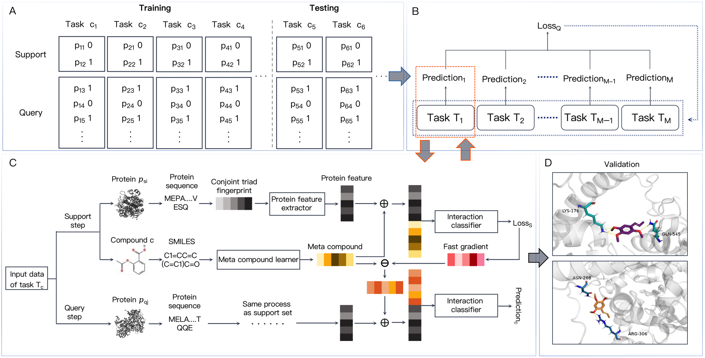

# CPOne

This repository is the project of **Enhanced Prediction of Compound-Protein Interactions through One-Shot Learning**.

This repository contains ***the source code and data***.

## Framework of CPOne


## Dependencies
Dependencies can be found in **environment.yml**.

## Using
```
python main.py
```
